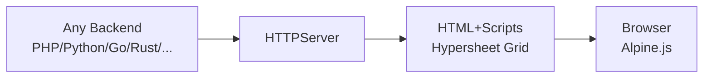

# Hypersheet by Platform

Hypersheet is backend-agnostic. The grid renders as plain HTML — any platform can serve it. Below are integration patterns for popular frameworks.

---

## PHP Platforms

### WordPress

**Option A: Shortcode**
Add to `functions.php`:

```php
add_shortcode('hypersheet_grid', function($atts) {
    $cols = json_decode(get_option('hypersheet_columns', '[]'), true);
    $rows = json_decode(get_option('hypersheet_rows', '[]'), true);
    $grid = new Hypersheet\Grid($cols, $rows);
    return $grid->render();
});
```

Then use `[hypersheet_grid]` in any post/page.

**Option B: Gutenberg Block**
Create a custom block that renders a Hypersheet grid with inline Alpine.js data. Enqueue scripts:

```php
add_action('wp_enqueue_scripts', function() {
    wp_enqueue_script('hypersheet', 'https://unpkg.com/hypersheet@0.1/dist/hypersheet.js', [], null, true);
    wp_enqueue_script('hypersheet-providers', 'https://unpkg.com/hypersheet@0.1/dist/providers.js', [], null, true);
    wp_enqueue_style('hypersheet-css', 'https://unpkg.com/hypersheet@0.1/dist/hypersheet.css');
});
```

**Option C: ACF Repeater Field**
Use Advanced Custom Fields repeater to let editors populate grid rows, then render via a template:

```php
$rows = [];
while (have_rows('grid_rows')) { the_row();
    $rows[] = [
        'name' => get_sub_field('name'),
        'status' => get_sub_field('status'),
    ];
}
$grid = new Hypersheet\Grid($columns, $rows);
echo $grid->render();
```

---

### Laravel

**Controller:**
```php
use Hypersheet\Grid;
use Hypersheet\Database\DatabaseFactory;

class GridController extends Controller
{
    public function index(Request $request)
    {
        $db = DatabaseFactory::create('pgsql');
        $db->connect(config('database.connections.pgsql'));
        $rows = $db->fetchRows('users', ['name', 'email', 'status', 'tier']);

        $enforcer = $request->user()?->casbinEnforcer();
        $grid = new Grid($columns, $rows);
        if ($enforcer) $grid->withAuthorization($enforcer, $request->user()->id);

        return view('grid', ['gridHtml' => $grid->render()]);
    }
}
```

**Blade Template:**
```blade
@extends('layouts.app')

@section('scripts')
    <script defer src="https://unpkg.com/hypersheet@0.1/dist/providers.js"></script>
    <script defer src="https://unpkg.com/hypersheet@0.1/dist/hypersheet.js"></script>
    <link rel="stylesheet" href="https://unpkg.com/hypersheet@0.1/dist/hypersheet.css">
@endsection

@section('content')
    {!! $gridHtml !!}
@endsection
```

**Artisan Command** for config cache:
```bash
php artisan vendor:publish --tag=hypersheet-config
```

---

### Magento

Add Hypersheet as a custom module. Create `app/code/Hypersheet/Grid/etc/module.xml` and a block class:

```php
class GridBlock extends \Magento\Framework\View\Element\Template
{
    public function getGridHtml()
    {
        $grid = new \Hypersheet\Grid($this->getColumns(), $this->getRows());
        return $grid->render();
    }
}
```

Add to layout XML (`view/frontend/layout/hypersheet_grid_index.xml`):
```xml
<page xmlns:xsi="http://www.w3.org/2001/XMLSchema-instance">
    <head>
        <link src="https://unpkg.com/hypersheet@0.1/dist/hypersheet.js" defer="defer" src_type="url"/>
        <link src="https://unpkg.com/hypersheet@0.1/dist/hypersheet.css" src_type="url"/>
    </head>
    <body>
        <referenceContainer name="content">
            <block class="Hypersheet\Grid\Block\GridBlock" template="Hypersheet_Grid::grid.phtml"/>
        </referenceContainer>
    </body>
</page>
```

---

## Python Platforms

### Django

**Settings:**
```python
INSTALLED_APPS = [
    ...
    'hypersheet',
]
```

**View:**
```python
from hypersheet import HyperSheetJinjaEngine
from django.shortcuts import render

def grid_view(request):
    engine = HyperSheetJinjaEngine()
    columns = [
        {'name': 'name', 'label': 'Name', 'type': 'text'},
        {'name': 'status', 'label': 'Status', 'type': 'chip'},
    ]
    rows = [
        {'id': '1', 'name': 'Alice', 'status': 'Active'},
    ]
    context = {
        'grid_html': engine.render_grid(columns, rows),
    }
    return render(request, 'grid.html', context)
```

**Template (`grid.html`):**
```html

<script defer src="https://unpkg.com/hypersheet@0.1/dist/providers.js"></script>
<script defer src="https://unpkg.com/hypersheet@0.1/dist/hypersheet.js"></script>
<link rel="stylesheet" href="https://unpkg.com/hypersheet@0.1/dist/hypersheet.css">

{{ grid_html|safe }}
```

### FastAPI

```python
from hypersheet import HyperSheetJinjaEngine
from fastapi import FastAPI, Request
from fastapi.responses import HTMLResponse
from fastapi.templating import Jinja2Templates

app = FastAPI()
templates = Jinja2Templates(directory="templates")
engine = HyperSheetJinjaEngine()

@app.get("/", response_class=HTMLResponse)
async def grid_page(request: Request):
    columns = [
        {'name': 'name', 'label': 'Name', 'type': 'text'},
        {'name': 'status', 'label': 'Status', 'type': 'chip'},
    ]
    rows = [{'id': '1', 'name': 'Alice', 'status': 'Active'}]
    return templates.TemplateResponse("grid.html", {
        "request": request,
        "grid_html": engine.render_grid(columns, rows),
    })
```

### Flask

```python
from flask import Flask, render_template
from hypersheet import HyperSheetJinjaEngine

app = Flask(__name__)
engine = HyperSheetJinjaEngine()

@app.route('/')
def grid():
    columns = [
        {'name': 'name', 'label': 'Name', 'type': 'text'},
        {'name': 'status', 'label': 'Status', 'type': 'chip'},
    ]
    rows = [{'id': '1', 'name': 'Alice', 'status': 'Active'}]
    return render_template('grid.html', grid_html=engine.render_grid(columns, rows))
```

### Pyramid

```python
from pyramid.view import view_config
from pyramid.response import Response
from hypersheet import HyperSheetJinjaEngine

engine = HyperSheetJinjaEngine()

@view_config(route_name='grid', renderer='templates/grid.jinja2')
def grid_view(request):
    columns = [
        {'name': 'name', 'label': 'Name', 'type': 'text'},
        {'name': 'status', 'label': 'Status', 'type': 'chip'},
    ]
    rows = [{'id': '1', 'name': 'Alice', 'status': 'Active'}]
    return {'grid_html': engine.render_grid(columns, rows)}
```

---

## Go Platforms

### jsweb (Standard `net/http`)

```go
package main

import (
    "net/http"
    hypersheet "github.com/hyperlibs/hypersheet"
)

func gridHandler(w http.ResponseWriter, r *http.Request) {
    columns := []hypersheet.Column{
        {Name: "name", Label: "Name", Type: "text"},
        {Name: "status", Label: "Status", Type: "chip"},
    }
    rows := []hypersheet.Row{
        {ID: "1", Data: map[string]string{"name": "Alice", "status": "Active"}},
    }
    grid := hypersheet.NewGrid(nil, "anonymous", columns, rows)
    w.Write([]byte(grid.Render()))
}

func main() {
    http.HandleFunc("/", gridHandler)
    http.ListenAndServe(":8000", nil)
}
```

### Other Go Frameworks

The `hypersheet.NewGrid()` works identically with any Go HTTP framework (Chi, Gin, Echo, Fiber). The grid renders to a string — embed it in your template response.

```go
// Gin
c.HTML(200, "grid.html", gin.H{"gridHTML": grid.Render()})

// Echo
return c.Render(http.StatusOK, "grid.html", map[string]interface{}{"gridHTML": grid.Render()})

// Fiber
return c.Render("grid", fiber.Map{"gridHTML": grid.Render()})
```

---

## Rust Platforms

### Actix-Web

```rust
use actix_web::{web, App, HttpServer, HttpResponse};
use hypersheet::{Grid, Column, Row};

async fn grid() -> HttpResponse {
    let columns = vec![
        Column { name: "name".into(), label: "Name".into(), cell_type: "text".into() },
        Column { name: "status".into(), label: "Status".into(), cell_type: "chip".into() },
    ];
    let rows = vec![
        Row { id: "1".into(), data: vec![("name", "Alice"), ("status", "Active")].into_iter().map(|(k,v)| (k.into(),v.into())).collect() },
    ];
    let grid = Grid::new(columns, rows);
    HttpResponse::Ok().body(grid.render())
}
```

### Axum

```rust
use axum::{Routing, Router, response::Html};
use hypersheet::{Grid, Column, Row};

async fn grid_handler() -> Html<String> {
    let grid = Grid::new(
        vec![Column::new("name", "Name", "text"), Column::new("status", "Status", "chip")],
        vec![Row::new("1", vec![("name", "Alice"), ("status", "Active")])],
    );
    Html(grid.render())
}
```

### Rocket

```rust
#[get("/")]
fn grid() -> String {
    let grid = Grid::new(columns, rows);
    grid.render()
}
```

---

## Static Site Generators

### Hugo

1. Place the grid HTML in a Hugo partial (`layouts/partials/grid.html`).
2. Load scripts in your base template:

```html
{{/* layouts/_default/baseof.html */}}
<head>
    <script defer src="https://unpkg.com/hypersheet@0.1/dist/providers.js"></script>
    <script defer src="https://unpkg.com/hypersheet@0.1/dist/hypersheet.js"></script>
    <link rel="stylesheet" href="https://unpkg.com/hypersheet@0.1/dist/hypersheet.css">
</head>
```

3. Use the partial anywhere:

```markdown
---
title: Dashboard
---

{{ partial "grid.html" . }}
```

Data can be populated from Hugo's data files (`data/grid.yaml`) or front matter.

### Other SSGs (11ty, Astro, Jekyll, Next.js SSG)

Same pattern — include the script tags, write the grid HTML inline or via a component/partial. Hypersheet has no build step requirements.

---

## JavaScript Meta-Frameworks

### Next.js (Pages Router)

```jsx
// pages/grid.js
import Script from 'next/script';

export default function GridPage() {
  return (
    <>
      <Script src="https://unpkg.com/alpinejs@3/dist/cdn.min.js" strategy="beforeInteractive" />
      <Script src="https://unpkg.com/hypersheet@0.1/dist/providers.js" strategy="beforeInteractive" />
      <Script src="https://unpkg.com/hypersheet@0.1/dist/hypersheet.js" />
      <link rel="stylesheet" href="https://unpkg.com/hypersheet@0.1/dist/hypersheet.css" />
      <div x-data="hypersheet({ rows: 5, cols: 3 })" @keydown.window="handleKey($event)">
        <table class="hg-grid">{/* ... */}</table>
      </div>
    </>
  );
}
```

### Nuxt 3

Create a `plugins/hypersheet.client.js`:
```js
export default defineNuxtPlugin(() => {
  if (process.client) {
    import('https://unpkg.com/hypersheet@0.1/dist/hypersheet.js');
    import('https://unpkg.com/hypersheet@0.1/dist/providers.js');
  }
});
```

Add CSS to `nuxt.config.ts`:
```ts
css: ['hypersheet/dist/hypersheet.css']
```

### SvelteKit

In your `+page.svelte`:
```svelte
<svelte:head>
  <script defer src="https://unpkg.com/alpinejs@3/dist/cdn.min.js"></script>
  <script defer src="https://unpkg.com/hypersheet@0.1/dist/providers.js"></script>
  <script defer src="https://unpkg.com/hypersheet@0.1/dist/hypersheet.js"></script>
  <link rel="stylesheet" href="https://unpkg.com/hypersheet@0.1/dist/hypersheet.css">
</svelte:head>

<div x-data="hypersheet({ rows: 5, cols: 3 })" @keydown.window="handleKey($event)">
  <!-- grid HTML -->
</div>
```

---

## Headless CMS Platforms

### Strapi

Create a custom Strapi plugin that serves grid data as JSON, and render the Hypersheet frontend in your static site:

```js
// strapi/src/api/grid/controllers/grid.js
module.exports = createCoreController('api::grid.grid', ({ strapi }) => ({
  async find(ctx) {
    const entries = await strapi.entityService.findMany('api::grid.grid');
    return { items: entries.map(e => ({ value: e.id, label: e.name })) };
  },
}));
```

Then configure a Hypersheet `ApiProvider` to point at your Strapi endpoint:

```js
provider: { type: 'api', url: '/api/grids' }
```

### Drupal

Create a custom Drupal block that renders the grid:

```php
function hypersheet_block_view() {
  $grid = new \Hypersheet\Grid($columns, $rows);
  return [
    '#markup' => $grid->render() .
      '<script defer src="https://unpkg.com/hypersheet@0.1/dist/hypersheet.js"></script>' .
      '<link rel="stylesheet" href="https://unpkg.com/hypersheet@0.1/dist/hypersheet.css">',
  ];
}
```

### Joomla

Create a custom module (`modules/mod_hypersheet/mod_hypersheet.php`):

```php
defined('_JEXEC') or die;
require_once JPATH_BASE . '/vendor/autoload.php';

$grid = new Hypersheet\Grid($columns, $rows);
$doc = JFactory::getDocument();
$doc->addScript('https://unpkg.com/hypersheet@0.1/dist/hypersheet.js');
$doc->addStyleSheet('https://unpkg.com/hypersheet@0.1/dist/hypersheet.css');

echo $grid->render();
```

---

## Other Frameworks

| Platform | Language | Integration Pattern |
|----------|----------|--------------------|
| **ASP.NET Core / Blazor** | C# | Render grid HTML in Razor view; serve `.js`/`.css` via `AddClientLib()` or `_Layout.cshtml` |
| **Ruby on Rails** | Ruby | Render grid in ERB view; `javascript_include_tag` for scripts; `stylesheet_link_tag` for CSS |
| **Spring Boot / Thymeleaf** | Java | `th:utext="${gridHtml}"` in template; resource handler for static JS/CSS |
| **Phoenix (Elixir)** | Elixir | Render grid in HEEx template; `import_js`/`import_css` in `app.js` |
| **Deno / Fresh** | TypeScript | Import from CDN in `_app.tsx`; use `dangerouslySetInnerHtml` for grid HTML |
| **Ktor (Kotlin)** | Kotlin | Serve grid HTML in `respondHtml` block; static resources for JS/CSS |
| **Symfony** | PHP | Install via `composer require hypersheet/hypersheet`; render in Twig |
| **Yii2** | PHP | Use `Hypersheet\Grid` in any view; register asset bundle for JS/CSS |
| **CakePHP** | PHP | Helper method `$this->Hypersheet->render($columns, $rows)` in view |
| **CodeIgniter** | PHP | Load via Composer, render in controller, pass to view |
| **.NET MAUI / Hybrid** | C# | WebView loading Hypersheet HTML; JS interop for cell events |
| **Electron / Tauri** | JS/Rust | Bundle as assets; use `x-data` directly in the renderer process |

---

## Platform Independence Principle

Hypersheet renders to **plain HTML**. Any platform that can serve a string can deliver a Hypersheet grid. The frontend (Alpine.js + providers.js) is loaded via CDN and requires no bundler.



This means you can:
- Start with a static HTML file (no backend)
- Add a PHP or Python server later
- Swap backends without touching frontend templates
- Use Hypersheet with any hosting (shared hosting, serverless, edge, static CDN)
